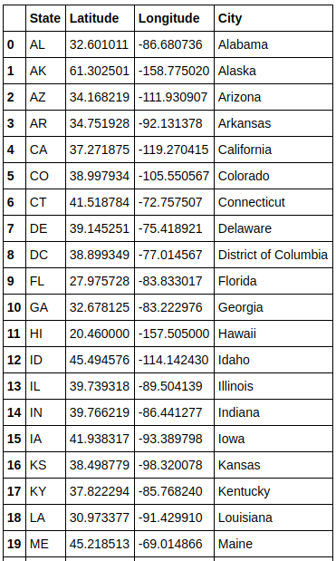

**Número da Lista**: 4 
**Dupla 5** 
**Conteúdo da Disciplina**: Dividir e conquistar - Pares de pontos mais próximos 

## Alunos
|Matrícula | Aluno |
| -- | -- |
| 17/0138551|Bruno Duarte|
| 17/0033112|Eugênio Sales|

## Sobre 
    Dentro de um dataset com latitude e longitude de alguns pontos em cado estado presente no território dos Estados Unidos com tráfego aéreo constante, o objetivo do presente trabalho é encontrar os pares ordenados das regiões mais próximos em um plano cartesiano. Ou seja, a região mais propícia para ocorrência de algum acidente aéreo no que tange colisões.
    
## Screenshots

 

## Depêndênias

**Linguagem**: Python (Jupyer Notebook)
 

## Execução

- Abra o arquivo rota_de_colisao_eua.ipynb no próprio github para visualização
- Ou abra no google colab 

## Uso 
Caso deseje executar as células

> 1 - Execute cada célula no jupyter notebook ou google colab

## Restrições
 * O dataset utilizado foi retirado do kaggle e serve para fins didáticos, não refletindo precisamente a realidade.
